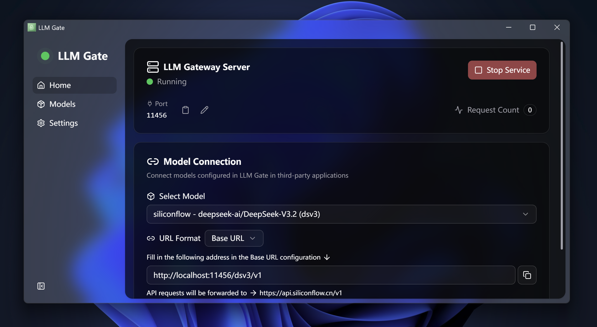

[**English**](./README.md) | [**简体中文**](./README-CN.md)

# LLM Gate

**LLM Gate** 是一个轻量级的本地 AI 网关，旨在安全地代理 LLM API 请求。基于 Tauri 构建，它拥有极小的体积和原生级的性能，支持 Windows 和 macOS。

> [!NOTE]
> 🚧 本项目目前正在积极开发中。如果您觉得有用，请考虑给它一个 ⭐ **star**！欢迎贡献和反馈。

使用 LLM Gate，您可以统一管理所有的 LLM API Key，并通过本地代理服务将其提供给其他软件，而无需暴露您的真实 Key，同时完美解决 CORS 问题。

## 🎬 截图


*(暗色模式展示；同样支持亮色模式)*

## 📥 下载

您可以从 [**Releases**](../../releases/latest) 页面下载最新版本。

- **Windows**: 下载 `.exe` 安装包。
- **macOS**: 下载 `.dmg` 镜像文件。

> [!IMPORTANT]
> **安全提示**：所有发布资源均通过 **GitHub Actions** 从源代码自动构建。这确保了您下载的二进制文件与本仓库中的开源代码完全匹配，提供完全的透明度和安全性。

## ✨ 功能特性

- **🚀 轻量级 & 跨平台**: 基于 **Tauri v2** 构建，安装包体积小，资源占用低。支持 Windows 和 macOS。
- **⚡ 高性能**: 核心网关（后端）完全使用 **Rust (Axum)** 编写，提供高并发处理能力和极快的响应速度。
- **🔄 自动更新**: 自动保持最新，获取最新功能和安全补丁。
- **🛡️ 安全 & 隔离**: 您的 API Key 安全地存储在本地。客户端（如插件或 Web 应用）仅连接本地代理地址，从未访问真实 Key。
- **🌐 CORS 解决方案**: 内置 **CORS** 支持，允许纯前端应用（如浏览器扩展或静态网站）直接调用主要模型 API，无需自行搭建反向代理服务器。

## 🎯 项目目标

1.  **统一 LLM API 管理**: 集中管理分散在不同提供商（OpenAI, Anthropic, DeepSeek 等）的 API Key。一次配置，即可在任何支持 OpenAI 格式的软件中使用。
2.  **API Key 安全**: 您不再需要将珍贵的 API Key 粘贴到不受信任的第三方软件或网页中。LLM Gate 作为中间人，自动注入 Key，确保它永远不会离开您的控制。
3.  **赋能前端开发**: 许多优秀的开源 LLM Web UI 由于浏览器 CORS 限制无法直接连接模型提供商 API。LLM Gate 作为本地代理解决了这个问题，使这些项目能够在本地运行。

## 📖 使用指南

1.  **下载 & 安装**: 请访问 [Releases](../../releases) 页面下载并安装适合您系统的版本。
2.  **添加模型**:
    - 打开 LLM Gate 并点击 "Add Model"。
    - 填写 **Model ID**（用于本地 URL）、**Base URL**（例如 `https://api.openai.com/v1`）和 **API Key**。
    - _(可选)_ 填写 **Model Name**。如果提供，LLM Gate 将在请求中自动用此值覆盖 `model` 参数。这对强制要求特定模型名称的客户端很有用。
3.  **启动代理**:
    - 在主页设置代理端口（默认为 `11456`）。
    - 点击 "Start Server" 按钮。
4.  **在其他软件中使用**:
    - **Base URL**: `http://localhost:11456/{your_model_id}/v1`
    - **API Key**: 输入任意字符串（例如 `sk-dummy`）。LLM Gate 将在转发时自动将其替换为真实 Key。

## 🔌 API 文档

假设您配置了一个 ID 为 `my-gpt4` 的模型，且代理运行在端口 `11456`。

### 接口格式

```
http://{host}:{port}/{model_id}/v1/{endpoint}
```

### 示例：使用 curl

```bash
curl http://localhost:11456/my-gpt4/v1/chat/completions \
  -H "Content-Type: application/json" \
  -H "Authorization: Bearer dummy-key" \
  -d '{
    "model": "gpt-4",
    "messages": [{"role": "user", "content": "Hello!"}]
  }'
```

### 示例：使用 OpenAI Python 库

```python
from openai import OpenAI

client = OpenAI(
    base_url="http://localhost:11456/my-gpt4/v1",
    api_key="dummy-key"  # 您可以在这里填入任何内容；LLM Gate 将自动注入真实 Key
)

response = client.chat.completions.create(
    model="gpt-4", # 如果您在 LLM Gate 中提供了 "Model Name"，这里的值将被自动替换
    messages=[
        {"role": "user", "content": "Hello, please introduce yourself."}
    ]
)

print(response.choices[0].message.content)
```

## 🛠️ 技术栈

- **Frontend**: Vue 3, TypeScript, Vite, Tailwind CSS 4, shadcn-vue (reka-ui)
- **Backend**: Rust, Axum, Reqwest, Tokio
- **Build System**: Tauri v2

## 💻 本地开发

如果您想贡献代码或在本地运行：

```bash
# 安装依赖
pnpm install

# 启动开发环境（同时启动前端和 Rust 后端）
pnpm tauri dev

# 构建生产版本
pnpm tauri build
```

## 📄 许可证

[AGPL-3.0](./LICENSE)
