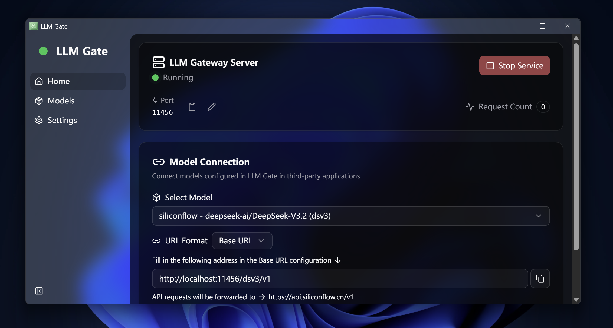

# LLM Gate

**LLM Gate** is a lightweight local AI gateway designed to securely proxy LLM API requests. Built on Tauri, it boasts a tiny footprint and native-level performance, supporting Windows and macOS.

> [!NOTE]
> 🚧 This project is currently under active development. If you find it useful, please consider giving it a ⭐ **star**! Contributions and feedback are always welcome.

With LLM Gate, you can unify the management of all your LLM API Keys and provide them to other software via a local proxy service without exposing your real keys, while also perfectly resolving CORS issues.

## 🎬 Screenshot


*(Shown in Dark Mode; Light Mode is also supported)*

## 📥 Download

You can download the latest version from the [**Releases**](../../releases/latest) page.

- **Windows**: Download the `.exe` installer.
- **macOS**: Download the `.dmg` disk image.

> [!IMPORTANT]
> **Security Note**: All release assets are automatically built from the source code via **GitHub Actions**. This ensures that the binaries you download exactly match the open-source code in this repository, providing full transparency and security.

## ✨ Features

- **🚀 Lightweight & Cross-Platform**: Built on **Tauri v2**, offering a small installer size and low resource usage. Supports Windows and macOS.
- **⚡ High Performance**: The core gateway (backend) is written entirely in **Rust (Axum)**, delivering high concurrency handling and blazing-fast response times.
- **🔄 Auto-Updates**: Stay up to date with the latest features and security patches automatically.
- **🛡️ Security & Isolation**: Your API Keys are securely stored locally. Clients (such as plugins or web apps) only connect to the local proxy address and never access the real keys.
- **🌐 CORS Solution**: Built-in **CORS** support allows pure frontend applications (like browser extensions or static websites) to call major model APIs directly, eliminating the need to set up your own reverse proxy server.

## 🎯 Project Goals

1.  **Unified LLM API Management**: Centralize API Keys scattered across different providers (OpenAI, Anthropic, DeepSeek, etc.). Configure once and use them in any software that supports the OpenAI format.
2.  **API Key Security**: You no longer need to paste valuable API Keys into untrusted third-party software or web pages. LLM Gate acts as a middleman, automatically injecting the key ensuring it never leaves your control.
3.  **Empowering Frontend Development**: Many excellent open-source LLM Web UIs cannot connect directly to model provider APIs due to browser CORS restrictions. LLM Gate acts as a local proxy to solve this problem, enabling these projects to run locally.

## 📖 User Guide

1.  **Download & Install**: Please visit the [Releases](../../releases) page to download and install the version suitable for your system.
2.  **Add a Model**:
    - Open LLM Gate and click "Add Model".
    - Fill in the **Model ID** (used in the local URL), **Base URL** (e.g., `https://api.openai.com/v1`), and **API Key**.
    - _(Optional)_ Fill in the **Model Name**. If provided, LLM Gate will automatically override the `model` parameter in your requests with this value. This is useful for clients that enforce specific model names.
3.  **Start Proxy**:
    - Set the proxy port on the home page (default is `11456`).
    - Click the "Start Server" button.
4.  **Use in Other Software**:
    - **Base URL**: `http://localhost:11456/{your_model_id}/v1`
    - **API Key**: Enter any string (e.g., `sk-dummy`). LLM Gate will automatically replace it with the real key during forwarding.

## 🔌 API Documentation

Assuming you have configured a model with ID `my-gpt4` and the proxy is running on port `11456`.

### Endpoint Format

```
http://{host}:{port}/{model_id}/v1/{endpoint}
```

### Example: Using curl

```bash
curl http://localhost:11456/my-gpt4/v1/chat/completions \
  -H "Content-Type: application/json" \
  -H "Authorization: Bearer dummy-key" \
  -d '{
    "model": "gpt-4",
    "messages": [{"role": "user", "content": "Hello!"}]
  }'
```

### Example: Using OpenAI Python Library

```python
from openai import OpenAI

client = OpenAI(
    base_url="http://localhost:11456/my-gpt4/v1",
    api_key="dummy-key"  # You can fill in anything here; LLM Gate will inject the real key
)

response = client.chat.completions.create(
    model="gpt-4", # If you provided a "Model Name" in LLM Gate, this will be automatically replaced
    messages=[
        {"role": "user", "content": "Hello, please introduce yourself."}
    ]
)

print(response.choices[0].message.content)
```

## 🛠️ Tech Stack

- **Frontend**: Vue 3, TypeScript, Vite, Tailwind CSS 4, shadcn-vue (reka-ui)
- **Backend**: Rust, Axum, Reqwest, Tokio
- **Build System**: Tauri v2

## 💻 Local Development

If you want to contribute or run the code locally:

```bash
# Install dependencies
pnpm install

# Start development environment (starts both frontend and Rust backend)
pnpm tauri dev

# Build for production
pnpm tauri build
```

## 📄 License

[AGPL-3.0](./LICENSE)
